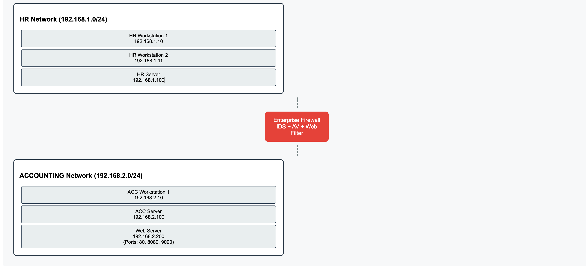

# 🛡️ Enterprise Firewall Management Project

## 📚 Table of Contents
- [Overview](#overview)
- [Network Architecture](#network-architecture)
- [Implementation Details](#implementation-details)
- [Security Policies](#security-policies)
- [Monitoring & Logs](#monitoring--logs)
- [Performance Metrics](#performance-metrics)
- [Documentation](#documentation)
- [Future Improvements](#future-improvements)

## 🌟 Overview
A comprehensive enterprise firewall implementation project completed during a 2-week internship at Rana Application. This project demonstrates advanced network segmentation, security policy implementation, and cyber threat protection for HR and ACCOUNTING departments.

### Project Timeline

## 🎯 Project Objectives
- **Firewall Technology Implementation**
- **Security Policy Development**
- **Service Deployment**
- **Network Monitoring**
- **Access Control Management**

## 🏗️ Architecture
[Here you should add a network diagram showing:
- HR and ACCOUNTING network segments
- Firewall placement
- Server locations
- Key connection points]

## 🛠️ Technologies Used
- OpenSSH Server
- Linux Web Server
- Windows RDP
- Virtual IP and Port Forwarding
- IDS (Intrusion Detection System)
- Antivirus Module
- Web Filtering System

## 🔑 Key Features Implemented

### Network Segmentation
- Strict separation between HR and ACCOUNTING networks
- Controlled inter-department communication
- Specific port access management (80, 8080, 9090)

### Security Policies
- Zero-trust approach (no "any" rules)
- Department-specific access controls
- Application-based restrictions
- Custom web filtering rules
## 🔒 Security Policy Implementation

### Firewall Rules Configuration

```python
# Example Python script for firewall rule management
class FirewallRule:
    def __init__(self):
        self.rules = []

    def add_rule(self, source, destination, port, protocol, action):
        rule = {
            'source': source,
            'destination': destination,
            'port': port,
            'protocol': protocol,
            'action': action
        }
        self.rules.append(rule)

# Example Usage
firewall = FirewallRule()

# HR to Accounting RDP Access
firewall.add_rule(
    source="192.168.1.0/24",      # HR Network
    destination="192.168.2.0/24",  # Accounting Network
    port=3389,                     # RDP Port
    protocol="TCP",
    action="ALLOW"
)

# Block Social Media for Accounting
firewall.add_rule(
    source="192.168.2.0/24",      # Accounting Network
    destination="*.facebook.com",  
    port=443,
    protocol="TCP",
    action="DENY"
)
### Service Configuration
1. Remote Access
   - SSH server deployment on Windows
   - RDP access configuration
   - Virtual IP implementation

2. Web Services
   - Multi-port web server deployment (80, 8080, 9090)
   - Access control policies
   - Traffic monitoring

### Security Modules
- **Antivirus Integration**
  - File download protection
  - Malware scanning

- **IDS Implementation**
  - Real-time threat detection
  - Malicious traffic blocking

- **Web Filtering**
  - Category-based filtering
  - Custom block lists
  - Department-specific rules

## 📊 Results and Achievements
[Consider adding a chart or metrics showing:
- Number of security policies implemented
- Blocked attack attempts
- System performance metrics]

### Key Accomplishments
- Successfully implemented departmental network segregation
- Deployed comprehensive logging system
- Established secure remote access protocols
- Implemented multi-layer security controls

## 🔄 Future Improvements
- SIEM Integration
- Advanced threat analysis implementation
- User training program development
- High availability configuration
- Custom policy enhancement
- Incident response testing

## 🔒 Security Considerations
- All implementations follow security best practices
- Data privacy measures in place
- Regular security audits
- Compliance with security standards

## 📝 Documentation
- Detailed configuration guides
- Network diagrams
- Policy documentation
- Security incident response procedures

## ⚠️ Disclaimer
This project was implemented in a controlled environment with proper authorization and supervision. All sensitive information has been removed from this documentation.

## 👤 Author
Ishak Askin

## 📅 Project Duration
August 7-18, 2023 (2 weeks)

---

[Note: For actual implementation, you should:
1. Create network topology diagrams using tools like draw.io
2. Add screenshots of your implementations (with sensitive data removed)
3. Include code snippets for any custom scripts
4. Add performance metrics and security statistics]
