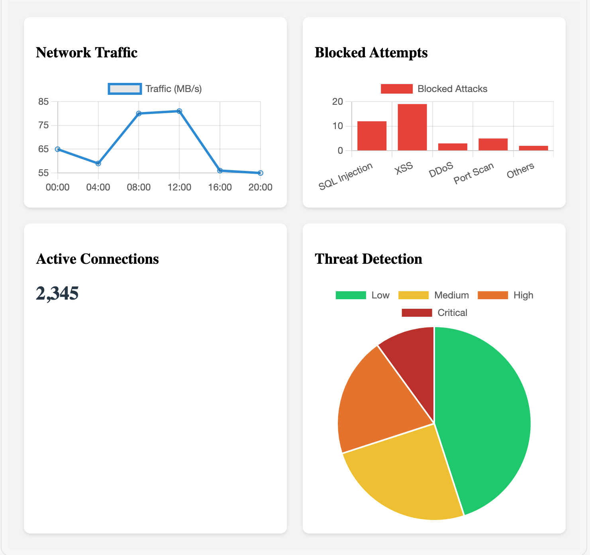
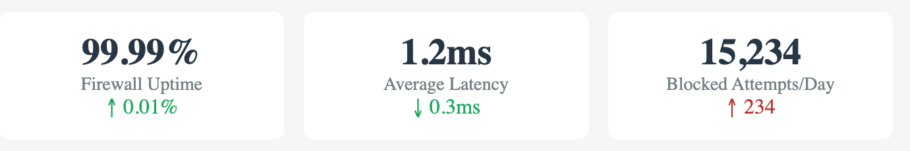

# 🛡️ Enterprise Firewall Management Project  

## 📚 Table of Contents  
- [Overview](#overview)  
- [Architecture](#architecture)  
- [Implementation Details](#implementation-details)  
- [Monitoring & Logs](#monitoring--logs)  
- [Performance Metrics, Results and Achievements](#results-and-achievements)  
- [Future Improvements](#future-improvements)  
- [Configuration Examples](#configuration)
- [Project Documentation](#dokumentation)  
- [Disclaimer](#disclaimer)  
- [Author](#author)  

---  

## Overview  
A comprehensive enterprise firewall implementation project completed during a 2-week internship at Rana Application. The project focuses on advanced network segmentation, security policy implementation, and cyber threat protection for the HR and ACCOUNTING departments.  

### Project Objectives  
- Implement firewall technologies  
- Develop security policies  
- Deploy essential services  
- Monitor network traffic  
- Manage access controls  

---  

## Architecture  
  

---  

## Implementation Details 
## Security Policy Implementation
### Firewall Rules Script

The script for managing firewall rules is available here:
[firewall_rules.sh](firewall_rules.sh)

### Technologies Used  
- OpenSSH Server  
- Linux Web Server  
- Windows RDP  
- Virtual IP and Port Forwarding  
- IDS (Intrusion Detection System)  
- Antivirus Module  
- Web Filtering System  

### Key Features  
#### Network Segmentation  
- Strict separation between HR and ACCOUNTING networks  
- Controlled inter-department communication  
- Port-specific access (80, 8080, 9090)  

#### Security Policies  
- Zero-trust approach (no "any" rules)  
- Department-specific access controls  
- Application-based restrictions  
- Custom web filtering rules  

#### Security Modules  
- **Antivirus Integration**: Malware scanning, file download protection  
- **IDS Implementation**: Real-time threat detection, malicious traffic blocking  
- **Web Filtering**: Category-based filtering, custom block lists  

#### Service Configuration  
- **Remote Access**: SSH and RDP setup, virtual IP implementation  
- **Web Services**: Multi-port server deployment, traffic monitoring and access control  

---  

## Monitoring & Logs 
Implemented a comprehensive logging system to track traffic and detect anomalies. 

---  

## Performance Metrics, Results and Achievements  
  

### Key Accomplishments  
- Successful departmental network segregation  
- Secure remote access protocols  
- Multi-layered security control implementation  

---  

## Future Improvements  
- SIEM integration  
- Advanced threat analysis  
- User training programs  
- High availability setup  
- Custom policy refinement  
- Incident response testing  

---  

## Configuration Templates
### SSH Server Configuration  
- Configuration examples [config.sh](config.sh)
- Firewall Base Configuration [firewall_config.sh](firewall_config.sh)
- Monitoring Setup [monitoring.sh](monitoring.sh)
- Incident [incident.yaml](incident.yaml)

## Project Documentation
### Change Log Template
| Date       | Change Description | Implemented By | Approved By |
|------------|-------------------|----------------|-------------|
| 2023-08-07 | Initial firewall setup | Ishak Askin | Team Lead |
| 2023-08-10 | HR policies implementation | Ishak Askin | Team Lead |

### Incident Response Template

## Disclaimer  
This project was implemented in a controlled environment with proper authorization and supervision. All sensitive information has been removed from this documentation.  

---  

## Author  
Ishak Askin  
